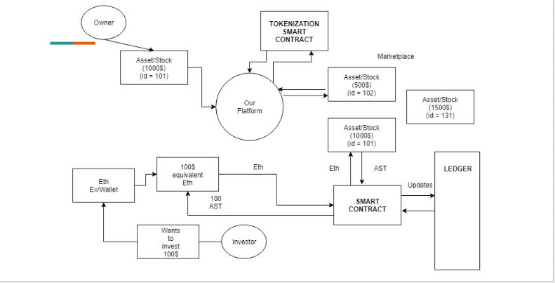
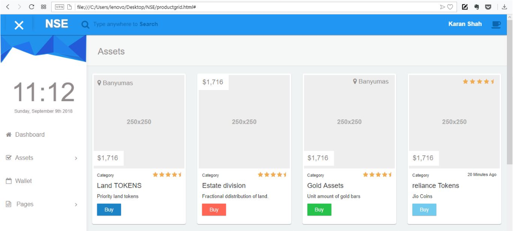

# Blockchain Based Smart Tokenization Platform for Asset Liquidation

## Introduction - Problem Statement:

Financial markets are full of different type of assets: stocks, CO2 emission credits, real estate, gold, lithium, oil, etc. However, most of these assets are hard to subdivide or transfer from one market participant to another. Due to this complexity, actors prefer trading papers that represent these assets. The main problem?—?it’s time consuming to track, exchange, liquidate and settle, and the process introduces substantive operational risk.

## Our Solution:

It is a blockchain-based Tokenization Platform to liquidate assets like Stocks, Pre-IPO Equities, Land and Real Estate, Gold, etc.

Our platform tokenizes such assets into equivalent worth of ERC20 tokens so that multiple investors can invest in same asset with any mount of money.

Imagine you can partly own/invest in a piece of land for $10...

Our project's main aim is to provide faster liquidity of assets, thereby ensuring quick settlement of the transactions and a secure "Ownership Ledger".

[Click to view Presentation Slides](https://docs.google.com/presentation/d/1JHVeJI0HzG8AeMS6eG0OdyHZaMs3GfbkE81jnGqjtDo/present)

## Features:

* Fast and Secure Processes
* Quick Liquidation of Assets
* Instant Settlement of Transactions
* Secure, Public, Immutable and Real Time - Ownership Provenance Ledger
* Material UI based Dashboard
* Investment using cryptocurrency
* Independent system. All processes backed by Smart Contracts

## Tech-Stack and Tools:

* Solidity
* Ethereum Blockchain
* Web3
* Truffle
* HTML, CSS, Javascript, jQuery

## Other Use Cases :

* Loan Syndication
* Crowdfunding
* Trading Intangible/Tangible/Fungible/Non-Fungible Assets
* ICOs  And many many more...

## Future Scope

* Verification of asset ownership through governmental bodies or organisations responsible to verify whether the asset coming into the platform matches with the current owner.

## Conclusion

Tokenization promises to change how broad asset classes are bought and sold, democratizing the process of owning everything from ideas to paintings. Blockchains offer a streamlined alternative to traditional paper markets and a unique way of sharing ownership of unique objects like painting or real estate.
Via the blockchain, ownership is slowly taking on new meaning.
